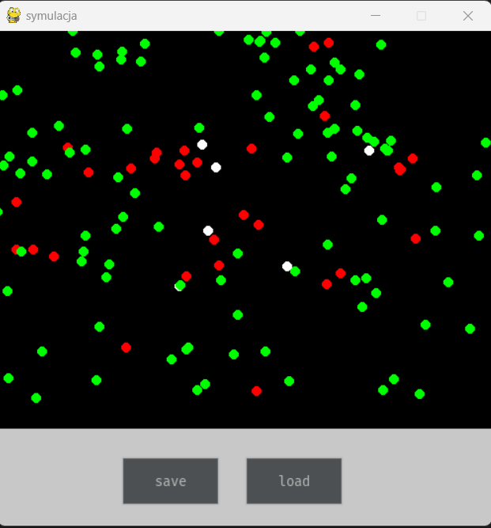

# Virus Spread Simulation

## Overview

This project simulates the spread of a virus within a population. It models various factors such as infection rate, recovery rate, and population movement to understand how a virus can propagate through a community.

## Features

- Visualization of virus spread over time.
- Saving and load simulation

## Simulation screenshot

